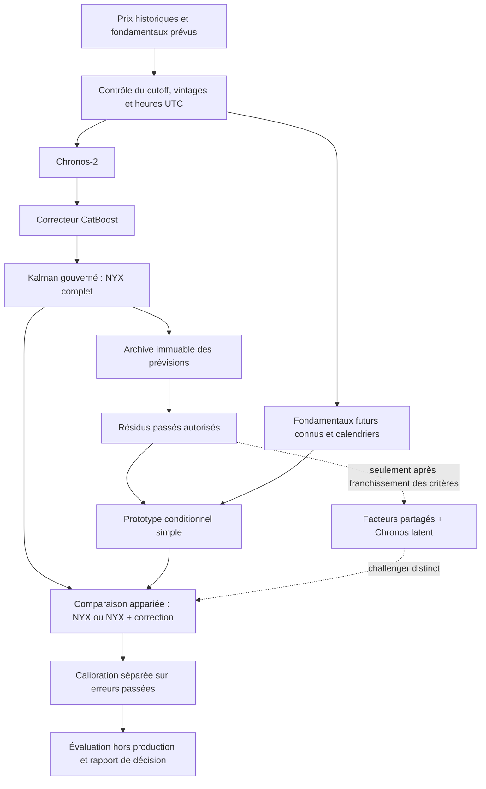

# Tensor-TimesFM pour NYX : décision fondée sur le code et les résultats

Audit du **15 septembre 2026**. Dépôt amont figé à **`130fd4787f268cbdd0d46ac5b840290b7c3440dc`**, commit du 19 juin 2026. NYX : code local effectivement présent, avec modifications de travail ; le seul HEAD Git ne suffit pas à le reproduire.

**Fait vérifié** désigne une lecture de code, une métadonnée contrôlée ou une mesure effectuée ici. **Hypothèse** désigne un mécanisme plausible qui reste à tester. **Proposition** désigne une architecture ou un critère de décision futur. Aucun nouveau modèle n'a été activé dans NYX, aucun entraînement de fondation ni chargement de poids TimesFM n'a été lancé.

## 1. Synthèse décisionnelle

**Recommandation : conserver NYX complet et ne pas engager maintenant son remplacement par Tensor-TimesFM.** Le meilleur usage immédiat de ce travail est méthodologique : tester explicitement la structure partagée et séparer représentation, prévision des facteurs et décodage. Les premières expériences réfutent l'intérêt des corrections simples fondées sur les seuls résidus passés, dans le protocole évalué. Elles ne réfutent pas toute architecture tensorielle conditionnée par des fondamentaux.

L'ordre d'investissement recommandé est : **calibration des intervalles et diagnostic des extrêmes**, puis, seulement avec un signal explicatif disponible au cutoff, **petit complément conditionnel après NYX**. L'adaptation tensorielle avec Chronos-2 reste une étape conditionnelle ultérieure. Le remplacement par un second modèle de fondation TimesFM est la piste la moins justifiée aujourd'hui.

Trois mesures motivent cette décision :

- **Structure partagée, mais pas de gain causal simple.** Deux composantes expliquent 85,89 % de la variance des erreurs de quatre pays sur le train. Pourtant, parmi treize configurations, la validation choisit NYX sans correction. Sur le test de 90 jours, la meilleure PCA-ridge retenue dans sa famille dégrade la MAE de **0,175 EUR/MWh**, IC bootstrap 95 % **[+0,026 ; +0,351]**.
- **La compression peut supprimer des différences utiles.** Une PCA des prix conservant 99,41 % de la variance du train laisse, avec des facteurs futurs parfaitement connus, **6,27 EUR/MWh de RMSE de reconstruction** sur le test et **17,31 EUR/MWh sur le spread BE−NL**. C'est un diagnostic oracle de projection linéaire, absolument pas une prévision ni une borne pour tous les décodeurs non linéaires.
- **Un problème directement observable : les intervalles.** Les bandes P10–P90 de NYX couvrent **72,99 à 75,87 %** des observations annuelles, pour une cible nominale de 80 %. Les pics positifs allemands sont particulièrement mal couverts.

**Confiance élevée** dans la décision de ne pas intégrer le dépôt tel quel et dans les constats sur le périmètre mesuré. **Confiance moyenne** dans l'ordre des prochains travaux : le test final est dominé par l'été et les historiques sont rétrospectifs. **Aucune estimation de gain de Tensor-TimesFM sur NYX** n'est possible sans ses propres prévisions appariées.

Les chiffres détaillés, scripts, empreintes et notes de lecture sont conservés dans le [dossier de recherche](C:/Users/BQ6757/chronos2_v1/research/tensor_timesfm_20260915/README.md).

## 2. Constats vérifiés sur les deux projets

### 2.1 La référence NYX est une chaîne complète

Le bouton de lancement appelle **NuclearKalman**, puis traite BE, DE, FR et NL. La chaîne utile à comparer est :

**Chronos-2 + calendriers + six fondamentaux prévus → CatBoost résiduel → Kalman gouverné → `residual_kalman` / export `nuclear_kalman`.**

Chronos seul est une ablation, pas la référence principale. Le parcours est vérifiable dans [NuclearKalman.ps1](C:/Users/BQ6757/chronos2_v1/NuclearKalman.ps1:21), [build_nuclear_kalman_plan](C:/Users/BQ6757/chronos2_v1/run_nuclear_kalman.py:63), [run_nuclear_forecast](C:/Users/BQ6757/chronos2_v1/chronos2_hourly/nuclear_forecast.py:408) et [publish_nuclear_exports](C:/Users/BQ6757/chronos2_v1/chronos2_hourly/nuclear_exports.py:130).

| Élément | Comportement réellement lu | Implication |
|---|---|---|
| Chronos-2 | `amazon/chronos-2`, contexte 2 048 heures, poids locaux, pas de fine-tuning ; `cross_learning=False` | Quatre cibles traitées séparément ; les covariables communes apportent déjà du partage |
| Fondamentaux | Charges résiduelles prévues FR/DE/BE/NL/ES et production nucléaire FR prévue, toutes en GW | Six entrées communes ; ES n'est pas une cinquième cible dans l'application |
| CatBoost | Cible `actual − Chronos_q50`, refit quotidien, 365 jours antérieurs ; 700 arbres, profondeur 6 ; correction ±40 EUR/MWh | NYX corrige déjà non linéairement l'erreur conditionnelle de Chronos |
| Kalman | Filtre causal, plusieurs candidats, gouverneur fondé sur les erreurs passées, correction ±20 EUR/MWh | Un nouveau biais multivarié doit prouver son apport au-delà de cette couche |
| Quantiles | CatBoost et Kalman appliquent chacun un décalage commun à q10/q50/q90 | Largeur préservée, sans recalibration de couverture |
| Variantes | LoRA désactivée ; `nuclear_cwe_v1` et `nuclear_kalman_extreme_v1` sont distincts | Ne pas agréger leurs sorties avec la référence NYX |

Sources : [appel Chronos](C:/Users/BQ6757/chronos2_v1/chronos2_modular/forecasting.py:397), [covariables nucléaires](C:/Users/BQ6757/chronos2_v1/chronos2_hourly/nuclear_forecast.py:245), [recette résiduelle FR](C:/Users/BQ6757/chronos2_v1/chronos2_hourly_fr_residual_v1.yaml:79), [ResidualCorrector.fit](C:/Users/BQ6757/chronos2_v1/chronos2_hourly/models/residual_corrector.py:1115), [gouverneur Kalman](C:/Users/BQ6757/chronos2_v1/chronos2_hourly/kalman_residual.py:1287), [LoRA](C:/Users/BQ6757/chronos2_v1/config/chronos2_exogenous_activation_v1.yaml:23). Le détail des 59 références figure dans la [note d'architecture NYX](C:/Users/BQ6757/chronos2_v1/research/tensor_timesfm_20260915/nyx_architecture.md).

**Temporalité.** La livraison est un jour civil complet ; le cutoff des fondamentaux est **D−1 à 08:00, heure de Paris**. Les sorties conservent les 23, 24 ou 25 heures physiques. Les prévisions de charge résiduelle et de nucléaire doivent couvrir entièrement la livraison. Les prix day-ahead de D−1 peuvent être connus avant leur livraison physique ; utiliser D−1 n'est donc pas automatiquement une fuite. En revanche, leur valeur révisée extraite ultérieurement ne prouve pas ce qui était disponible à l'ancien cutoff. [Contrat horaire](C:/Users/BQ6757/chronos2_v1/chronos2_hourly/hourly_contract.py:358), [plan de livraison](C:/Users/BQ6757/chronos2_v1/chronos2_hourly/chronos_adapter.py:172).

**Limite de preuve importante.** Les audits déclarent `provider_revision_timestamp_available=false` et `production_pit_evidence=false`. La sélection rétrospective « as-of » est contrôlée ; elle ne remplace pas l'archive de ce que le fournisseur avait effectivement publié. Le gel peut incorporer des observations historiques réactualisées. Les rapports historiques reconstruits à partir d'un run ultérieur ne sont pas des prévisions effectivement émises à ces dates. [nuclear_sources](C:/Users/BQ6757/chronos2_v1/chronos2_hourly/nuclear_sources.py:145), [refreshed_target_snapshot](C:/Users/BQ6757/chronos2_v1/run_nuclear_forecast.py:543).

La grille des cibles gère DST, mais certaines covariables ont des conventions de réparation : duplication automnale possible d'une heure fournie une seule fois et quatre réparations ponctuelles de charge résiduelle NL au printemps dans le sidecar courant. Cela doit rester visible dans les masques et audits d'une nouvelle expérience.

### 2.2 Faiblesses mesurées de NYX

**Sources utilisées.** Le dernier ensemble complet commun trouvé est celui de la livraison **16/09/2026**. Son backtest final couvre les **365 jours du 16/09/2025 au 15/09/2026**, soit 8 760 heures par pays et **35 040 points NYX**. La prévision du 16 n'entre pas dans les scores. Les bundles, observations et comparateurs ont été vérifiés par les lecteurs du projet et leurs empreintes enregistrées.

La comparaison Storm ci-dessous retient les **8 759 heures communes par pays** : une valeur Storm manque sur l'année. Biais = prévision − observation ; unités EUR/MWh.

| Pays | MAE NYX | MAE Storm | RMSE NYX | RMSE Storm | Biais NYX | Couverture P10–P90 NYX¹ |
|---|---:|---:|---:|---:|---:|---:|
| BE | 11,165 | 10,936 | 23,824 | 23,499 | −1,048 | 74,46 % |
| DE | 11,120 | 11,444 | 22,071 | 20,174 | −0,712 | 74,34 % |
| FR | 12,087 | 11,857 | 19,060 | 18,501 | −0,088 | 72,99 % |
| NL | 11,172 | 11,000 | 22,486 | 20,594 | −0,757 | 75,87 % |

¹ Couverture sur les 8 760 heures NYX, indépendamment de la valeur Storm manquante. Ces différences descriptives ne suffisent pas à établir une supériorité statistique annuelle de Storm ou de NYX. L'heure exacte de disponibilité de Storm au cutoff 08:00 n'est pas établie ici : il est un comparateur, pas une entrée autorisée du prototype.

**Heures et saisons.** Les heures locales 19–21 concentrent les plus fortes erreurs BE/DE/NL : MAE DE 18,38 à 19:00, BE 17,88 et NL 17,81 à 20:00. FR atteint 14,90 à 19:00. La MAE BE passe de 6,86 en hiver à 14,94 en été ; FR culmine au printemps à 15,07. Il n'y a qu'un cycle annuel : ce constat ne démontre pas une loi saisonnière stable.

**Prix négatifs et pics.** Les seuils de pics sont fixés aux quantiles 95/99 des 180 premiers jours, par pays ; ce ne sont pas les quantiles réestimés sur le test. Sur les prix négatifs, la MAE NYX est BE 17,79, DE 13,81, FR 13,36 et NL 15,64 ; les biais sont positifs, compatibles avec une prévision insuffisamment négative en moyenne. Sur les prix supérieurs au q99 du train :

| Pays | Heures sur l'année | Seuil q99 train | MAE NYX | Biais NYX | Couverture P10–P90 |
|---|---:|---:|---:|---:|---:|
| BE | 388 | 183,82 | 39,81 | −26,44 | 61,34 % |
| DE | 104 | 249,92 | 102,26 | −87,46 | 33,65 % |
| FR | 626 | 158,46 | 14,96 | −7,15 | 70,61 % |
| NL | 155 | 216,53 | 73,23 | −55,05 | 52,26 % |

**Interprétation.** Les erreurs sur les gros pics DE/NL et la sous-couverture des bandes constituent des problèmes démontrés. Leur cause exacte ne l'est pas : plafonds de correction, fondamentaux incomplets, changement de régime ou représentation du modèle doivent être isolés par ablation. Une couverture conditionnelle mesurée sur les prix futurs extrêmes n'est pas un segment identifiable avec certitude au moment de prévoir.

**Sensibilité des labels.** Une divergence matérielle frozen/latest par pays a été trouvée, à la même heure du 16 juin 2026 ; maximum 9,305 EUR/MWh, différence absolue moyenne annuelle ≤0,001065. Les milliers d'autres petits écarts sont compatibles avec la représentation float32. Aucun écart matériel dans le test final. La cause des quatre divergences n'est pas prouvée ; la faible sensibilité numérique n'établit pas une disponibilité historique au cutoff.

Mesures et effectifs : [descriptifs](C:/Users/BQ6757/chronos2_v1/research/tensor_timesfm_20260915/metrics/descriptive_metrics.csv), [calibration et scores d'intervalle](C:/Users/BQ6757/chronos2_v1/research/tensor_timesfm_20260915/metrics/nyx_interval_calibration.csv), [provenance](C:/Users/BQ6757/chronos2_v1/research/tensor_timesfm_20260915/metrics/extraction_manifest.json), [sensibilité des labels](C:/Users/BQ6757/chronos2_v1/research/tensor_timesfm_20260915/metrics/label_revision_sensitivity.json).

### 2.3 Tensor-TimesFM : mécanisme réel, avec plusieurs recettes différentes

**Principe lu dans le code.** Les scripts apprennent une table de facteurs temporels `E[T,R]` et des embeddings structurels par entreprise, trajet, produit, magasin ou variable. Pour une cellule, ils **concatènent** les embeddings puis appliquent un MLP scalaire. Malgré les noms « CP », il ne s'agit pas simplement d'une somme de produits de rang CP : `R` est une dimension d'embedding. TimesFM prévoit chaque coordonnée temporelle comme une série, puis le décodeur recompose les cellules futures. Les pertes ignorent les cellules manquantes ; les zéros réels demeurent observés.

**EPS.** Le tenseur annoncé est `[158 trimestres, 9 583 entreprises, 14 variables]`, très incomplet. La recette lit un rang 739, deux têtes distinctes reconstruction/prévision de largeur 1 024, un adaptateur temporel résiduel et une régression EPS supplémentaire. TimesFM 2.0/500M est gelé ; embeddings et têtes sont entraînés. Les objectifs combinent reconstruction masquée, prévision des variables, régression EPS, décorrélation et pénalité quadratique. La perte latente a un poids nul dans la commande principale. La régression utilise le consensus d'analystes de la période cible, supposé connu avant la réalisation ; sa disponibilité est une hypothèse de données spécifique, et le masque d'évaluation exige aussi ce consensus. Le parcours de test prévoit les facteurs au-delà de l'historique, avec une reconstruction explicite du dernier facteur non directement supervisé. Il ne faut donc pas réduire le gain à « TimesFM appliqué à des facteurs ». [TensorTimesFM et têtes](https://github.com/LarryC01/Tensor-TimesFM-ECML-2026/blob/130fd4787f268cbdd0d46ac5b840290b7c3440dc/examples/EPS_TimesFM_debug_best.py#L360-L483), [evaluate_one_step](https://github.com/LarryC01/Tensor-TimesFM-ECML-2026/blob/130fd4787f268cbdd0d46ac5b840290b7c3440dc/examples/EPS_TimesFM_debug_best.py#L927-L990), [commande exacte](https://github.com/LarryC01/Tensor-TimesFM-ECML-2026/blob/130fd4787f268cbdd0d46ac5b840290b7c3440dc/examples/full_command_EPS_best.sh#L64-L105).

**Rideshare.** Le tenseur annoncé est `[541 heures, 156 trajets, 15 variables]`, environ 59 % observé, horizon 168. Le MLP utilise les facteurs temps/trajet/variable. La normalisation est calculée sur le train ; la prévision TimesFM est détachée et la table temporelle gelée pendant la supervision du bloc appelé validation. Cette variante n'apprend donc pas ses facteurs par rétropropagation de cette perte à travers TimesFM. Le script courant utilise un seul découpage final, pas la boucle glissante suggérée par certains commentaires. [Classe](https://github.com/LarryC01/Tensor-TimesFM-ECML-2026/blob/130fd4787f268cbdd0d46ac5b840290b7c3440dc/examples/rideshare_3d_tensor/Rideshare_TimesFM_debug_Sept22_3losses_ortho_multi_step.py#L758-L851), [prévision détachée](https://github.com/LarryC01/Tensor-TimesFM-ECML-2026/blob/130fd4787f268cbdd0d46ac5b840290b7c3440dc/examples/rideshare_3d_tensor/Rideshare_TimesFM_debug_Sept22_3losses_ortho_multi_step.py#L625-L661).

**Défaut précis dans cette recette Rideshare.** Avec T=541, contexte 210 et horizon 168, la reconstruction apprend les indices 0…210. Le test utilise la table aux indices 163…372 ; **162 des 210 lignes de ce contexte n'ont pas reçu de gradient d'observation**. Les facteurs prévus pour la validation ne remplacent pas ces lignes. Une reproduction miniature du contrat d'indices et de gradients a confirmé ce mécanisme sur CPU, sans exécuter TimesFM. Les lignes peuvent subir la décroissance des poids ; nous ne prétendons pas qu'elles restent identiques bit à bit à leur initialisation. C'est un défaut de contexte, pas une utilisation des observations futures, et l'attribution aux chiffres du README reste non établie. [Construction du contexte](https://github.com/LarryC01/Tensor-TimesFM-ECML-2026/blob/130fd4787f268cbdd0d46ac5b840290b7c3440dc/examples/rideshare_3d_tensor/Rideshare_TimesFM_debug_Sept22_3losses_ortho_multi_step.py#L2004-L2014), [test](https://github.com/LarryC01/Tensor-TimesFM-ECML-2026/blob/130fd4787f268cbdd0d46ac5b840290b7c3440dc/examples/rideshare_3d_tensor/Rideshare_TimesFM_debug_Sept22_3losses_ortho_multi_step.py#L2215-L2226), [diagnostic reproductible](C:/Users/BQ6757/chronos2_v1/research/tensor_timesfm_20260915/rideshare_context_check.json).

**Walmart.** La recette couple ventes et prix `[1 941 jours, 3 049 articles, 10 magasins]` et événements `[1 941,41]`. Les facteurs temporels sont partagés ; plusieurs décodeurs et pertes de reconstruction pondérées apprennent les modalités. L'inférence prévoit les facteurs, puis les ventes sur 28 jours. Les événements/prix sont ici des modalités reconstruites du passé : ce n'est pas une API générale injectant explicitement les fondamentaux futurs connus. Une nouvelle factorisation est ajustée par bloc externe ; la « validation » interne porte sur une plage déjà utilisée en reconstruction. Elle ne constitue pas un jeu temporel indépendant de sélection, même si le bloc externe de test est futur. [CoupledCPDecomposition](https://github.com/LarryC01/Tensor-TimesFM-ECML-2026/blob/130fd4787f268cbdd0d46ac5b840290b7c3440dc/walmart_lagp_TimesFM_debug_Nov_17.py#L431-L450), [sliding_window_validation](https://github.com/LarryC01/Tensor-TimesFM-ECML-2026/blob/130fd4787f268cbdd0d46ac5b840290b7c3440dc/walmart_lagp_TimesFM_debug_Nov_17.py#L295-L335), [boucle externe](https://github.com/LarryC01/Tensor-TimesFM-ECML-2026/blob/130fd4787f268cbdd0d46ac5b840290b7c3440dc/walmart_lagp_TimesFM_debug_Nov_17.py#L1004-L1030).

**Gel ne signifie pas absence de coût de gradient.** EPS et Walmart appellent l'interface privée `_model.decode` pour conserver un graphe vers les facteurs malgré les poids TimesFM gelés. Cela est possible dans le code Google inspecté, contrairement au chemin public qui utilise `no_grad` et NumPy. La version amont n'étant pas épinglée, cette compatibilité n'est pas garantie pour l'environnement des scores publiés. La maintenance d'une telle interface privée serait une charge nouvelle pour NYX. [Décodeur Google figé](https://github.com/google-research/timesfm/blob/8cb0628371af142e16b8c232cc9fbf667ffb12f9/v1/src/timesfm/pytorch_patched_decoder.py#L712-L787), [prévision publique](https://github.com/google-research/timesfm/blob/8cb0628371af142e16b8c232cc9fbf667ffb12f9/v1/src/timesfm/timesfm_torch.py#L122-L153).

### 2.4 Revendications, preuves et reproductibilité amont

Le README annonce, face à TimesFM, des RMSE **0,7671 → 0,5534 pour EPS**, **2,2904 → 2,2787 pour Walmart**, **2,4568 → 2,1040 pour Rideshare**. Walmart dégrade légèrement le R². Ces résultats concernent des données, horizons et budgets distincts des prix électriques. Ils n'ont pas été reproduits ici. [Tableau du dépôt](https://github.com/LarryC01/Tensor-TimesFM-ECML-2026/blob/130fd4787f268cbdd0d46ac5b840290b7c3440dc/README.md#L18-L30).

Les réserves sont concrètes :

- La baseline Walmart inspectée charge **TimesFM 1.0/200M**, la recette tensorielle **2.0/500M**. Sans manifeste reliant chaque score à sa commande, on ne peut isoler l'effet du tenseur. [Baseline](https://github.com/LarryC01/Tensor-TimesFM-ECML-2026/blob/130fd4787f268cbdd0d46ac5b840290b7c3440dc/examples/ablation_studies/Walmart/TimesFM_Walmart.py#L281-L302).
- La baseline EPS propose par défaut une prévision stochastique ; trois CSV fournissent une trace partielle, dont un proche du tableau, sans reconstruire les dix graines ni le checkpoint exact. Il faut distinguer moyenne prédite et tirage aléatoire. [Arguments](https://github.com/LarryC01/Tensor-TimesFM-ECML-2026/blob/130fd4787f268cbdd0d46ac5b840290b7c3440dc/examples/ablation_studies/EPS/TimesFM_EPS.py#L329-L345).
- La grille Rideshare demande 500 configurations et une clé W&B absente du script courant. Le désalignement est vérifié ; une sélection effectivement réalisée sur le test n'est pas prouvée. [Grille](https://github.com/LarryC01/Tensor-TimesFM-ECML-2026/blob/130fd4787f268cbdd0d46ac5b840290b7c3440dc/examples/rideshare_3d_tensor/sweep_Rideshare_TimesFM_Sept23_multi_step.yaml#L4-L63).
- Les données distribuées sont temporellement tronquées : EPS 15 pas, ventes/prix Walmart 194, alors que la configuration Walmart demande 365 pas d'historique. Les données EPS complètes exigent un accès externe. [Conditionnement](https://github.com/LarryC01/Tensor-TimesFM-ECML-2026/blob/130fd4787f268cbdd0d46ac5b840290b7c3440dc/dataset_truncation_description.txt#L5-L31).
- **TimesFM manque dans `environment.yml`** ; plusieurs dépendances ne sont pas figées. `setup.py` et `CITATION.cff` conservent des éléments PyTorchTS. Aucun manuscrit correspondant n'a été identifié dans le dépôt ou les recherches effectuées ; publication et acceptation ECML restent non vérifiées. [Environnement](https://github.com/LarryC01/Tensor-TimesFM-ECML-2026/blob/130fd4787f268cbdd0d46ac5b840290b7c3440dc/environment.yml#L7-L83).

**Matériel et licences.** Les recettes visent CUDA, de grands lots et 8–16 workers ; ni GPU précis ni durée/VRAM reproductible n'ont été établis. Les poids TimesFM 2.0 occupent environ 2 Go, hors activations, données et optimisation. Gelés, ils peuvent néanmoins nécessiter des activations pour le gradient vers les entrées. Le code du dépôt affiche MIT et conserve une licence Apache 2.0 GluonTS ; les poids Google 1.0 et 2.0 inspectés affichent Apache 2.0. Les droits des données sont séparés. [Licence du dépôt](https://github.com/LarryC01/Tensor-TimesFM-ECML-2026/blob/130fd4787f268cbdd0d46ac5b840290b7c3440dc/LICENSE), [carte officielle 2.0 figée](https://huggingface.co/google/timesfm-2.0-500m-pytorch/blob/dc2443792ce5516872b89b37cf1bc058c3bf0c10/README.md), [fichiers des poids](https://huggingface.co/google/timesfm-2.0-500m-pytorch/tree/dc2443792ce5516872b89b37cf1bc058c3bf0c10).

La [note amont complète](C:/Users/BQ6757/chronos2_v1/research/tensor_timesfm_20260915/upstream_evidence.md) conserve les liens, la traçabilité partielle et les nuances. Le dépôt est une source d'idées, pas un composant industriel prêt à être intégré.

### 2.5 Expériences légères réalisées pour décider

**Protocole fixé avant consultation des résultats de test des candidats.** 180 jours initiaux jusqu'au 14/03/2026 ; validation du 15/03 au 17/06, 95 jours ; test séparé du **18/06 au 15/09, 90 jours**. Treize configurations : identité, EWMA pays ou pays×heure (demi-vies 7/28 jours), ridge uni/multivariée (régularisation 10/100), PCA-ridge (rangs 1/2, mêmes régularisations). La sélection de famille et des paramètres utilise uniquement la MAE de validation sur labels figés.

Les variables sont les erreurs passées à la même heure civile à D−2 et des moyennes exponentielles passées, par pays et pays×heure. **Aucun fondamental futur nouveau n'a été ajouté**. Les transformations, imputations et PCA sont ajustées sur les seules lignes éligibles, avec refit tous les sept jours et fenêtre cible de 180 jours. Le premier refit comporte moins de jours exploitables du fait de l'amorçage des retards. Les labels des jours précédents du test deviennent utilisables selon la règle D−2, sans nouvelle sélection de paramètres : c'est une évaluation séquentielle, pas un modèle figé pendant 90 jours.

La règle D−2 est volontairement conservatrice mais ne prouve pas les vintages. Les deux heures physiques d'automne sont évaluées ; leur moyenne est utilisée uniquement pour la variable retardée indexée par heure civile. La journée de printemps conserve 23 cibles ; les variables retardées manquantes sont imputées à partir du train.

**Mesure : la validation retient l'identité NYX.** Les autres lignes ci-dessous sont les meilleurs paramètres de chaque famille retenus sur validation ; elles ne sont pas choisies a posteriori sur le test. 8 640 points test, quatre pays. Δ = méthode − NYX ; un Δ négatif favorise la méthode.

| Méthode | MAE test | Δ MAE | IC 95 % du Δ MAE | Décision sur cette recette |
|---|---:|---:|---:|---|
| NYX complet | 14,191 | 0 | — | Référence et gagnant de validation |
| + EWMA pays | 14,224 | +0,032 | [−0,111 ; +0,192] | Aucun bénéfice établi |
| + EWMA pays×heure | 14,463 | +0,271 | [+0,107 ; +0,474] | Dégradation |
| + ridge univariée | 14,486 | +0,295 | [+0,140 ; +0,482] | Dégradation |
| + ridge multivariée | 14,659 | +0,467 | [+0,219 ; +0,741] | Dégradation |
| + PCA-ridge | 14,366 | +0,175 | [+0,026 ; +0,351] | Dégradation |

La PCA-ridge réduit ponctuellement le RMSE d'environ 0,057, avec IC [−0,254 ; +0,289] : cela ne compense ni la MAE dégradée ni l'incertitude. La réduction du biais par EWMA ne suffit pas non plus à améliorer la qualité globale. Storm obtient 12,758 de MAE sur ce test, Δ −1,433, IC [−3,618 ; +0,199] : avantage ponctuel mais non concluant avec cet intervalle.

Les intervalles utilisent **2 000 rééchantillonnages par blocs mobiles de sept jours**, avec les pays et heures appariés ensemble. Ils sont conditionnels aux 90 jours et paramètres sélectionnés ; ils ne capturent ni l'incertitude des vintages ni celle de toute la recherche antérieure. Les contrastes secondaires pays/régimes ne sont pas corrigés pour comparaisons multiples. Le test a maintenant été ouvert : il ne doit pas devenir la validation des prochains modèles.

**Coût mesuré :** boucle des petits modèles et bootstrap, environ **3,6 s**, RSS relevée **178 Mo** ; extraction et contrôles environ 7,8 s. Il s'agit de mesures d'un passage local, pas d'un SLA ni d'un pic mémoire garanti. Les 151 refits ont passé les contrôles de cutoff ; une perturbation des labels D−1 et futurs laisse les caractéristiques EWMA de D inchangées. Aucun gain prospectif et aucun score Tensor-TimesFM n'ont été mesurés. [Résumé et contrôles](C:/Users/BQ6757/chronos2_v1/research/tensor_timesfm_20260915/metrics/experiment_summary.json), [sélection verrouillée](C:/Users/BQ6757/chronos2_v1/research/tensor_timesfm_20260915/metrics/validation_selection_locked.json), [scores et IC](C:/Users/BQ6757/chronos2_v1/research/tensor_timesfm_20260915/metrics/locked_test_paired_bootstrap.csv).

**Expérience distincte : compression oracle.** Centrage/PCA des quatre prix ajustés sur les 180 jours train ; projection des véritables prix futurs du test, sans prévision des facteurs. Aux rangs 1/2/3, variance train conservée 86,41/98,03/99,41 %, mais RMSE de reconstruction test 20,73/11,74/6,27 EUR/MWh. Au rang 3, 151 des 522 prix négatifs deviennent non négatifs ; le spread BE−NL reste mal reconstruit. Au rang 4 la reconstruction est trivialement exacte, sans compression. Ce diagnostic falsifie le raccourci « presque toute la variance est conservée, donc les événements utiles le sont ». Il ne juge pas toutes les représentations non linéaires. [Protocole, tableaux et script](C:/Users/BQ6757/chronos2_v1/research/tensor_timesfm_20260915/compression/oracle_compression.md).

## 3. Pistes classées par intérêt et faisabilité

Les coûts ci-dessous sont des appréciations d'architecture, **pas des durées d'entraînement mesurées**. Les quatre pistes demandées sont toutes examinées ; la première ligne ajoute l'alternative directement motivée par les données.

| Rang | Piste | Intérêt pour NYX | Faisabilité / effort | Preuves et décision |
|---:|---|---|---|---|
| 1 | Calibration séparée et diagnostic des pics | Problèmes déjà mesurés ; exploite la chaîne existante | Élevée / faible à moyen | Sous-couverture démontrée ; bénéfice d'une correction encore à tester |
| 2 | Complément conditionnel aux résidus/fondamentaux/inter-pays | Peut expliquer les erreurs que le Kalman ne corrige pas | Élevée pour ridge ; moyenne pour petit réseau / moyen | Résidus seuls testés sans gain ; poursuivre uniquement avec hypothèse informationnelle nouvelle |
| 3 | Représentation partagée + Chronos-2 latent | Réutilise le modèle installé, teste le prévisionniste latent | Moyenne / moyen à élevé | Compression mesurée ; prévisibilité latente non démontrée |
| 4 | Ensemble NYX + challenger validé | Réduit le risque si erreurs complémentaires et poids stables | Élevée après disponibilité du challenger / faible pour la combinaison, coût des deux modèles | Aucune prévision Tensor-TimesFM locale : complémentarité inconnue |
| 5 | Tensor-TimesFM concurrent complet | Diversité de modèle et apprentissage partagé | Faible à moyenne / élevé | Aucun gain NYX ; seulement quatre séries denses, dépendances et protocole amont à corriger |

### Contrat de données commun aux adaptations

**Proposition.** Conserver d'abord `Y[T,4]` en heures physiques UTC, cible prix ou résidu en EUR/MWh. Le tableau des fondamentaux `X[T,6]` contient les cinq charges résiduelles et le nucléaire FR **prévus au cutoff de chaque livraison**. Garder ce tableau séparé évite de compter quatre fois les mêmes valeurs en les répétant artificiellement sur l'axe pays. Calendriers : heure locale, jour de semaine, férié pertinent, offset et fold. La date d'émission, la date de livraison et l'heure de réception sont des champs distincts.

Une forme tensorielle possible est `[heure UTC, pays=4, variable=F]`, où F ne comprend que des canaux réellement distincts et horodatés. Une autre est `[jour, slot local=25, pays=4]` : le slot est le couple heure/fold, et les absences structurelles des jours de 23/24 heures sont masquées. Le panneau UTC reste la source de vérité. Transformer quatre séries en 96 ou 100 cellules journalières **n'ajoute pas de journées indépendantes d'apprentissage**.

Normalisation robuste ou centrage-échelle par canal, appris sur train uniquement et figé dans chaque bloc ; retour explicite aux unités physiques. Garder les valeurs négatives, éviter logarithme et winsorisation systématique des cibles. Masques séparés : cellule structurellement absente, donnée source manquante, donnée reçue trop tard. Zéro réel ≠ manquant. Imputation causale avec indicateur et règle de repli ; aucune interpolation utilisant la droite future.

Les prévisions séparées de demande, solaire, éolien, disponibilités BE/NL, flux ou contraintes réseau ne sont pas toutes démontrées comme entrées complètes au cutoff dans ce parcours. Elles nécessitent leur propre audit de vintages. Le nucléaire actuel est une prévision de génération, pas la disponibilité Pmax. Les réalisations futures de ces fondamentaux ne doivent jamais remplacer leurs prévisions.

### Piste A — complément après NYX : option préférée, conditionnelle

**Hypothèse.** Un écart entre prévisions de fondamentaux, un profil de charge résiduelle ou une interaction pays×heure explique une partie des erreurs extrêmes restantes. La seule persistance des erreurs ne le fait pas dans notre expérience.

**Structure proposée.** Cible `R[T,4]=prix−NYX_q50`, avec `X[T,6]`, calendriers, q10/q50/q90 et variables retardées disponibles. Premier modèle : ridge avec interactions limitées ; second seulement si nécessaire : petit MLP conditionnel de largeur 32–64, sortie quatre corrections, connexion additive directe à NYX. Option factorielle : rang 1/2 partagé **plus un terme propre à chaque pays**, sans forcer le prix complet dans un sous-espace. Toutes les corrections restent en EUR/MWh. Les bornes et poids sont sélectionnés sur validation, identité admissible.

**Réemploi / intégration.** Réutiliser la lecture vérifiée des bundles, plans horaires, sélection des fondamentaux et manifests. Écrire un exécuteur de recherche après `kalman_view`, sans modifier le cache nucléaire. Reprendre les idées de masques et de partage du dépôt ; réimplémenter les petits composants nécessaires, plutôt que porter ses scripts monolithiques. [Lecture des bundles](C:/Users/BQ6757/chronos2_v1/chronos2_hourly/nuclear_run_archive.py:203).

**Coût / échec / réfutation.** Ridge et PCA sont peu coûteuses ; le réseau exige un nouvel ajustement et une surveillance de stabilité. Risque principal : ajouter une troisième correction redondante avec CatBoost/Kalman et réagir trop tard aux pics. Comparer résidus seuls, +fondamentaux, +interactions pays ; abandonner si les nouveaux canaux n'améliorent pas les pertes hors échantillon ou si les gains disparaissent face à une ridge sans tenseur. Le premier test résidus seuls a déjà échoué à cette barrière.

### Piste B — facteurs partagés prévus avec Chronos-2

**Hypothèse.** Chronos prévoit la dynamique des facteurs mieux qu'une persistance, une autorégression ou une ridge, à coût marginal acceptable. Réutiliser Chronos n'est pas une preuve de transférabilité aux coordonnées latentes apprises.

**Structure proposée.** Matrices couplées `Y[T,4]` et `X[T,6]`, facteurs temporels `Z[T,r]` avec r=1/2/4 au départ, décodeur linéaire puis petit décodeur conditionnel. Quatre facteurs sur quatre prix ne compressent plus l'axe pays : cette ablation reste utile pour distinguer changement de coordonnées et réduction. Préférer d'abord un résidu avec connexion directe NYX à une reconstruction exclusive du prix. Décoder avec les fondamentaux futurs autorisés ; ils ne sont pas supposés prévus par le seul latent.

**Réemploi / intégration.** Réutiliser l'environnement et le chargeur Chronos local ; nouvelle identité d'expérience, nouvelles sorties et nouveaux caches. Apprendre et figer encodeur/base/décodeur sur le passé, puis appeler l'API publique de prévision de Chronos. Ce prototype par étapes ne reproduit pas la rétropropagation EPS à travers une API privée. Si le dernier facteur autorisé est D−2, prévoir toutes les heures intermédiaires jusqu'à D puis sélectionner D ; ne pas appeler horizon 24 en sautant un jour.

**Coût / échec / réfutation.** Évite un second checkpoint, mais ajoute prévisions latentes, ajustement de représentation et suivi des bases. Aucun temps Chronos latent n'est mesuré ici. Réfuter avec même représentation/décodeur et prévisionnistes persistence, AR/ridge, Chronos ; conserver uniquement si Chronos apporte un gain net avec mêmes données et budget. Si PCA+ridge ou correction directe suffit, arrêter le latent neuronal.

### Piste C — Tensor-TimesFM challenger complet

**Hypothèse.** Un décodeur partagé et la dynamique TimesFM apprennent une structure que NYX complet exploite mal. L'hypothèse est plus plausible si l'on dispose plus tard de nombreuses zones, actifs, flux ou modalités clairsemées cohérentes ; elle est faible sur quatre prix denses seulement.

**Structure proposée.** Même contrat causal que la piste B ; r=2/4 et décodeur 64/128 avant toute augmentation. Ne pas transposer les rangs 739–2 000 et largeurs 1 024 des benchmarks. Séparer pertes prix, fondamentaux et masques avec échelles explicites ; ne pas laisser une unité GW ou un grand nombre de cellules reconstruites dominer la qualité en EUR/MWh. Apprendre un décodeur conditionnel aux covariables réellement disponibles ; tester MSE contre Huber/quantile sur validation, pas sur les extrêmes du test déjà consulté.

**Réemploi / intégration.** Extraire l'idée embeddings+décodeur, les pertes masquées et le partage de facteurs. Réécrire les découpages, l'inférence hors échantillon et les contrats de covariables ; épingler code, poids et paquet TimesFM. Nouveau moteur concurrent, aucun branchement transparent à la place de Chronos : modifier l'amont imposerait de réajuster causalement CatBoost et Kalman pour une comparaison de chaînes complètes.

**Coût / échec / réfutation.** Second modèle de fondation de 500M, données/activations, entraînement de têtes et éventuellement gradients traversants ; maintenance Windows/CUDA et interfaces privées. CPU possible dans le code, durée acceptable inconnue. Fixer un budget court avant tout essai futur. Réfuter contre TimesFM direct de **même version**, PCA+TimesFM, décodeur linéaire, petit réseau sans fondation, Chronos latent et NYX complet. Si le gain vient seulement des covariables ou du décodeur, garder ce composant plus simple.

### Piste D — ensemble avec NYX

**Hypothèse.** Les erreurs du challenger restent suffisamment différentes de NYX, notamment lorsque NYX échoue, pour qu'un poids modeste réduise la perte. La corrélation contemporaine seule ne suffit pas ; des erreurs différentes mais énormes peuvent nuire.

**Structure proposée.** Prévisions appariées `[jour, heure physique, pays, modèle=2]`, même unité EUR/MWh, même cutoff, masque commun. Point initial : `(1−w)NYX + w·challenger`, w global ou pays fortement régularisé, appris sur validation passée avec w=0 admissible. Pas de poids libre par chaque heure/régime avec un an seulement. Pour les distributions, définir une mixture de scénarios et recalibrer ; une moyenne de quantiles n'est pas généralement le quantile d'une mixture.

**Réemploi / intégration.** Lecteurs d'exports et comparateur apparié ; sortie de recherche distincte. Le mélange est bon marché mais impose le coût et la disponibilité des deux modèles. Identité NYX si challenger manquant, tardif ou invalide, avec événement de repli enregistré.

**Réfutation.** Courbes perte vs poids sur validation, puis poids verrouillé sur nouveau test ; stabilité par pays, saison et extrêmes. Aucune prédiction Tensor-TimesFM locale n'existe aujourd'hui pour faire cette preuve. Les corrélations NYX/Storm observées ne prouvent rien sur NYX/Tensor-TimesFM et n'autorisent pas l'usage de Storm à 08:00.

## 4. Architecture recommandée

**Proposition : une branche de recherche parallèle, avec identité NYX toujours disponible.** Seul le premier diagnostic a été exécuté ; les modules conditionnel et de calibration ci-dessous sont à concevoir puis valider.

**Facteurs cohérents.** Les embeddings peuvent changer de signe, permutation ou rotation entre refits. La décorrélation n'identifie pas une base unique et la pénalité de norme ne rend pas les facteurs prévisibles. Figer les loadings dans chaque bloc ; lors d'un refit, aligner les nouvelles coordonnées sur les anciennes à partir du **chevauchement passé seulement** : signes/permutations pour PCA simple, Procrustes si rotations nécessaires. Enregistrer base, normaliseur, période et transformation. Si l'alignement est instable, reconstruire tout le contexte dans la nouvelle base ; ne pas concaténer des latents incompatibles. Pour un décodeur non linéaire, vérifier que l'alignement préserve effectivement les sorties.

**Intervalles après décodage.** `g(E[Z])` n'est pas en général `E[g(Z)]` ; décoder séparément des quantiles marginaux latents ne fournit pas des quantiles de prix. Il faut des scénarios joints des facteurs, leur dépendance temporelle/inter-pays et un terme d'erreur de décodage ; décoder chaque scénario, puis extraire les quantiles empiriques. TimesFM 2.0 ne garantit pas la calibration de ses têtes. Une calibration glissante indépendante, par pays avec régularisation des sous-groupes, doit ensuite être évaluée. [Carte officielle](https://huggingface.co/google/timesfm-2.0-500m-pytorch/blob/dc2443792ce5516872b89b37cf1bc058c3bf0c10/README.md).

Pour le prototype immédiat, commencer par les intervalles existants : quantiles d'erreurs passées ou calibration conforme/CQR glissante, sans promettre de garantie d'échangeabilité sous dépendance temporelle. Mesurer couverture, dépassements bas/haut, largeur, pinball q10/q50/q90, score d'intervalle 80 % et WIS à un intervalle. Ce WIS limité n'est ni un CRPS ni une évaluation de toute la distribution. Le complément ponctuel testé ici n'a produit **aucun nouveau quantile**.

## 5. Premier prototype minimal et protocole décisif

### Ce qui existe déjà à l'issue de cette mission

Un banc de recherche isolé lit les bundles vérifiés, aligne les heures, produit les analyses par pays/heure/saison/régime, mesure la calibration, compare les corrections causales simples et conserve leurs prévisions, choix de validation, refits et IC. Le diagnostic oracle et le contrôle miniature du contexte Rideshare complètent cette preuve. Ces artefacts suffisent déjà à **rejeter l'ajout de PCA-ridge sur résidus seuls dans la recette testée**.

### Prochaine tranche proposée, limitée et réfutable

**Périmètre.** Quatre pays, NYX complet inchangé, six fondamentaux déjà autorisés, sans LoRA ni TimesFM. Deux axes indépendants : (i) recalibrer les bandes existantes ; (ii) expliquer les résidus avec les fondamentaux et le calendrier. Le réseau tensoriel n'est pas requis dans cette tranche.

Composants à créer dans un futur espace de recherche, noms proposés :

| Composant | Responsabilité | Réemploi |
|---|---|---|
| `build_cutoff_dataset.py` | Produire panneau prix/résidus/fondamentaux avec date de réception, livraison, masques et SHA | Sélection PIT, `load_nuclear_result_bundle`, contrat DST |
| `conditional_residual.py` | Ridge conditionnelle et interactions limitées ; identité obligatoire | Banc causal déjà livré, aucune mutation des résultats NYX |
| `rolling_interval_calibration.py` | Calibration glissante q10/q90 sur erreurs disponibles | Quantiles NYX existants, contrôles d'ordre et de finitude |
| `rolling_evaluation.py` | Découpages, appariement, ablations, blocs bootstrap, coûts et replis | Scripts de cette mission à modulariser |
| `latent_adapter.py`, ultérieurement | Base factorielle, prévision Chronos et décodage séparés | Seulement après preuve d'intérêt du partage et budget accepté |

**Protocole temporel proposé.** Réserver à l'avance un nouveau test, car juin–septembre a été consulté. Développement par plusieurs origines glissantes de 28 jours avec train 180/365 jours et validation interne uniquement antérieure ; initialiser tous les prétraitements dans chaque fold. Aucun futur n'entre dans normalisation, imputation, factorisation, décodeur, stopping, calibration, choix de paramètres ou combinaison. La publication du jour D n'utilise que les données reçues au cutoff ; si la date de réception n'existe pas, qualifier l'expérience de rétrospective. Passer à D−1 pour les labels uniquement lorsque leur disponibilité exacte est démontrée ; jusque-là, conserver D−2 et l'horizon physique complet correspondant.

L'évaluation prospective devra enregistrer réellement les entrées et prévisions au moment de leur émission. Les mises à jour ultérieures des observations servent de labels versionnés ; elles ne réécrivent ni les entrées ni les sorties originales. Conserver séparément score sur première observation vérifiée et score sur révision finale lorsque cette distinction existe.

**Ablations minimales.** NYX complet ; Chronos seul ; Chronos+CatBoost ; identité du nouveau complément ; résidus seuls ; +fondamentaux ; +interactions inter-pays ; normalisation identique sans PCA ; PCA/ridge ; éventuellement PCA/Chronos ; même latent avec décodeur linéaire puis non linéaire. Le retrait d'une couche qui change la distribution d'une couche ultérieure nécessite son refit causal, pas le réemploi d'un correcteur appris sur un autre amont. Pour TimesFM futur, ajouter direct vs latent avec version, contexte et budget identiques. Fixer une petite grille, par exemple au plus 20 recettes, avant test.

**Mesures et incertitude.** MAE principale en EUR/MWh, RMSE et biais secondaires ; pertes par pays, heure physique/civile, saison, négatif, pics q95/q99 du train, grandes erreurs de spread. Rapporter effectifs d'heures et d'événements distincts, pas seulement une moyenne. Regrouper les pics consécutifs pour ne pas compter cent heures du même choc comme cent événements indépendants. Bootstrap apparié des blocs journaliers communs aux quatre pays : sept jours en principal, sensibilité 14/28 ; nouveau tirage de blocs pour chaque fold sans mélanger apprentissage et test. Les sous-groupes restent exploratoires ou utilisent une correction de multiplicité annoncée.

**Coût et robustesse.** Mesurer temps d'ajustement, temps d'inférence, temps total avec lecture/chargement, p50/p95 et maximum, RSS pic/VRAM, taux d'échec, délai de publication, taux de repli et sensibilité aux graines. Essayer source manquante, valeur tardive, jour de 23/25 heures et processus interrompu. L'environnement NYX lu comporte Torch XPU, mais la sélection automatique actuelle vise CUDA ou CPU ; aucune accélération XPU n'est garantie. Ne pas confondre les quelques secondes du banc ridge avec le coût du pipeline complet.

### Critères proposés avant toute nouvelle comparaison

Ces seuils sont une **politique de décision proposée**, pas des gains attendus ni une garantie statistique.

- **Poursuivre un correcteur ponctuel** s'il réduit la MAE appariée d'au moins 2 % face à NYX et face à la meilleure référence simple, avec IC du Δ MAE entièrement négatif sur le nouveau test ; pas de RMSE globale dégradée de plus de 1 %, ni MAE pays ou régime critique dégradée de plus de 5 %. Si les intervalles sont trop larges faute d'événements, décision « preuve insuffisante », pas succès.
- **Poursuivre la calibration** si le score d'intervalle ou WIS s'améliore, que la couverture globale se rapproche de 80 % sans élargissement incontrôlé, et que la sous-couverture des segments critiques recule. Fixer par exemple une plage de couverture globale 77–83 % comme contrôle pratique, accompagnée de son incertitude ; ne pas optimiser la largeur seule.
- **Abandonner une complexité** si son gain disparaît face à la ridge ou au décodeur linéaire, dépend d'un seul choc, requiert des réalisations futures, ou ne tient pas les heures limites. Les recettes de résidus seuls évaluées ici ne franchissent déjà pas le premier critère.
- **Budget initial proposé :** coût marginal d'inférence et d'ajustement quotidien inférieur à une minute sur la machine cible pour le petit complément, moins de 1 Go de RAM supplémentaire, aucune dépendance GPU nouvelle. Ce sont des plafonds à vérifier, pas des performances promises. Une expérience de fondation ultérieure nécessite son propre budget mesuré.
- **Accéder au prospectif** seulement après contrat de données et validation des critères ; collecter au moins 60 livraisons, prolonger vers 90 ou davantage si extrêmes, changements de saison ou DST insuffisamment représentés. Le modèle reste en parallèle ; passage en production seulement après revue des résultats réellement émis et procédure de repli vérifiée.

## 6. Feuille de route avec conditions de passage

| Étape | Livrable | Condition de passage / arrêt |
|---|---|---|
| 0 — audit et falsification légère, **terminés** | Code amont figé, cartographie NYX, mesures annuelles, test séparé, oracle de compression | Conserver NYX ; ne pas intégrer les corrections de résidus seuls testées |
| 1 — données et calibration | Archives à l'émission ; labels révisés séparés ; recalibration glissante isolée | Provenance et cutoff démontrables ; scores probabilistes meilleurs sur nouveau test |
| 2 — signal conditionnel | Résidus + fondamentaux connus, ridge et ablations | Gain apparié robuste, contrôle des pics/pays/coût ; sinon arrêter cette branche |
| 3 — représentation partagée + Chronos | Comparaison mêmes données/décodeur, persistence/ridge/Chronos | Apport propre du latent prévisionnel, facteurs stables, meilleur que piste simple |
| 4 — TimesFM ou ensemble, optionnels | Challenger isolé, versions figées, protocole amont corrigé | Justification par diversité ou expansion réelle des données ; complémentarité mesurée hors test de sélection |
| 5 — validation prospective | Prévisions réellement émises, suivi coûts/calibration/événements, repli testé | Critères prédéfinis satisfaits ; sinon conserver NYX actuel |

Les informations qui restent manquantes sont identifiées : véritables vintages fournisseur aux anciens cutoffs, manuscrit et correspondance complète des scores Tensor-TimesFM, coûts de ses recettes sur cette machine, et prévisions locales de challengers pour mesurer leur complémentarité. Elles empêchent une revendication de gain ou une décision de déploiement, mais n'empêchent pas la décision actuelle : **les preuves disponibles justifient la simplicité, et orientent l'effort vers la calibration et les erreurs conditionnelles extrêmes.**
